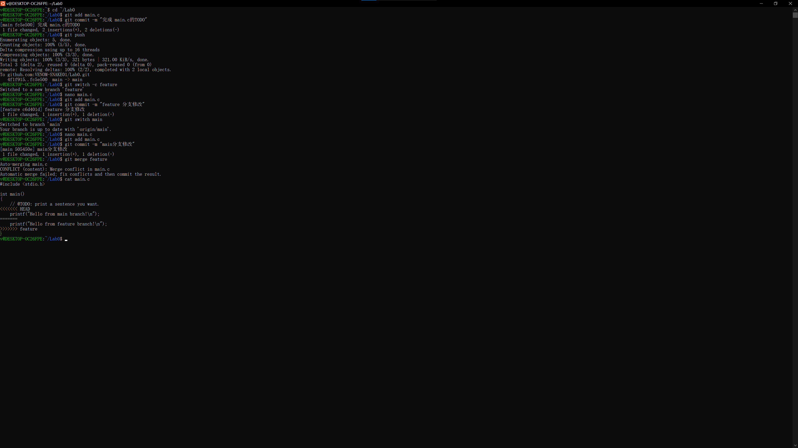
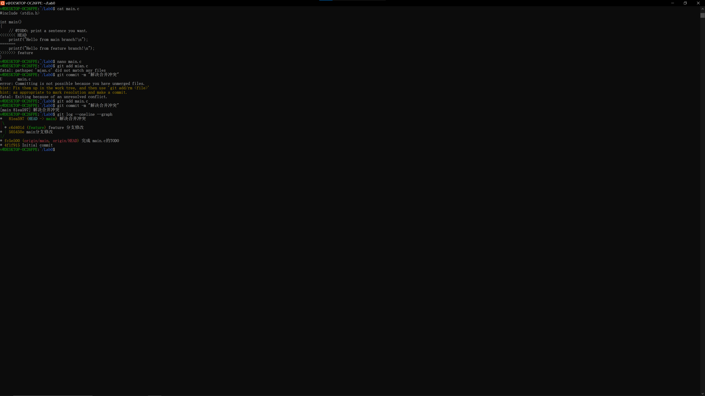

# Lab0 实验报告

## 一、文档问题回答

### 1. 你之前有过多人协同开发的经历吗？如果有，你们是使用什么方式分工协作的？

之前没有正式的多人协作开发经历。最多是通过微信/QQ传文件或者用网盘共享代码，文件名会加上 _v1、_final、_最终版 之类的后缀来区分版本，经常出现文件覆盖、版本对不上号的问题，非常不方便。如果多人同时修改同一个文件，只能手动逐行对比合并，效率很低。

### 2. 思考一下，Git 为什么要设计"暂存-提交"两个步骤？

暂存区（Staging Area）的作用类似于"购物车"。它让开发者可以在正式提交之前，挑选本次要提交哪些改动，而不是把工作区的所有修改一股脑全部提交。这样做的好处是：
- 可以将不相关的修改拆分成多个有意义的 commit
- 提交前可以再次检查（git status / git diff），避免把临时调试代码一起提交
- 让每次 commit 的目的更清晰，便于后续回溯和 review

### 3. git branch 和 git branch -a 的区别是什么？

- `git branch`：只列出本地分支
- `git branch -a`：列出所有分支，包括本地分支和远程跟踪分支（形如 remotes/origin/xxx）

## 二、阅读材料与思考

我选择阅读了《Commit Message 规范》和《Git Flow 分支控制》两篇文章。

### Commit Message 规范
文章介绍了 Angular 社区的 Commit message 写法规范。核心格式是 type(scope): subject，其中 type 包括 feat（新功能）、fix（修复bug）、docs（文档）、style（格式）、refactor（重构）、test（测试）、chore（构建/工具）等。规范化的 commit message 能让提交历史清晰可读，方便快速浏览每次改动的目的，还能自动生成 Change log。

### Git Flow 分支控制
文章介绍了 Gitflow 分支管理策略，使用五种分支各司其职：master（线上生产代码，永久分支）、develop（开发主分支，永久分支）、feature（开发新功能，从 develop 拉出）、release（发布前测试）、hotfix（紧急修复线上 bug，从 master 拉出）。合并时推荐用 --no-ff 保留分支历史。

### 为什么要学习 Git
Git 是现代软件开发的基础工具。它让代码的每一次修改都有迹可循，可以随时回溯到任意版本；它让多人协作更加融洽，不同开发者可以在不同分支上并行开发而不互相干扰，最后再合并；它让代码审查、版本发布、bug 修复都有了标准化的流程。不掌握 Git，就无法融入现代的开发团队。

## 三、实验步骤（使用到的命令）

1. 安装并配置 Git
   - git config --global user.name "VENOM-SNAKE01"
   - git config --global user.email "1552447462@qq.com"

2. 配置 SSH 密钥并添加到 GitHub
   - ssh-keygen -t ed25519 -C "1552447462@qq.com"
   - 将公钥添加到 GitHub SSH keys
   - ssh -T git@github.com 验证成功

3. 使用模板仓库创建个人仓库并克隆到本地
   - git clone git@github.com:VENOM-SNAKE01/Lab0.git

4. 完成 main.c 的 TODO 并提交
   - 修改 printf 内容为 "Hello, ICS 26F!"
   - git add main.c
   - git commit -m "完成 main.c的TODO"
   - git push

5. 分支管理与合并冲突
   - git switch -c feature
   - 在 feature 分支将 printf 改为 "Hello from feature branch!" 并提交
   - git switch main
   - 在 main 分支将 printf 改为 "Hello from main branch!" 并提交
   - git merge feature → 出现冲突
   - 手动删除冲突标记，保留 main 分支版本
   - git add main.c && git commit -m "解决合并冲突"
   - git push

## 四、截图

### 截图 1：遇到合并冲突

### 截图 2：解决冲突后的提交历史

## 五、建议

希望后续实验能增加更多 Git 进阶操作的练习，比如 rebase、stash、cherry-pick 等。
